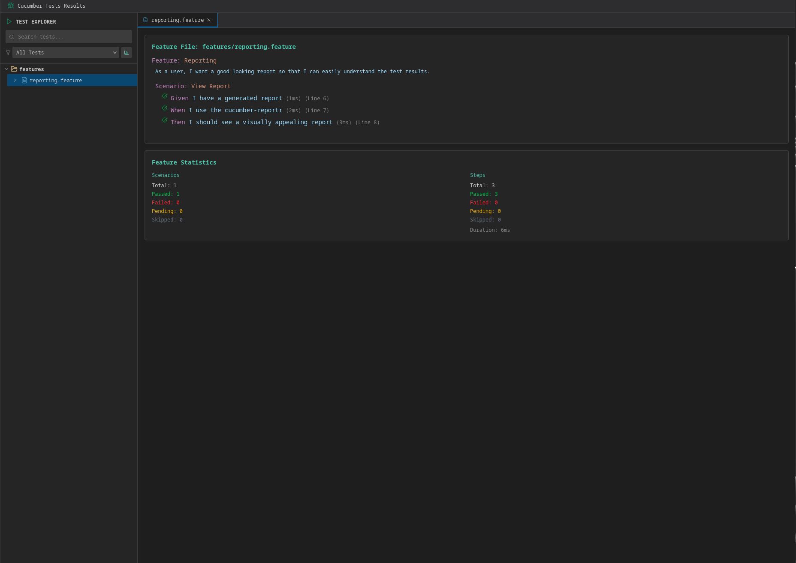
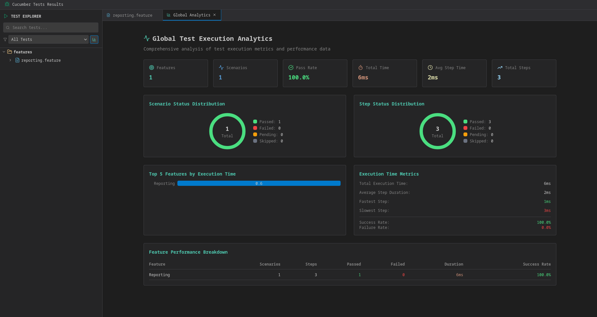

# Cucumber Reportr

[](https://github.com/nil-malh/cucumber-reportr/actions/workflows/ci.yml)
[](https://central.sonatype.com/artifact/io.github.nil-malh/cucumber-reportr)
[](https://opensource.org/licenses/Apache-2.0)
[](https://codecov.io/gh/nil-malh/cucumber-reportr)

Frontend : [](https://sonarcloud.io/summary/new_code?id=nil-malh_cucumber-reportr_frontend)

Plugin : [](https://sonarcloud.io/summary/new_code?id=nil-malh_cucumber-reportr_plugin)

A modern, interactive Cucumber reporter that generates beautiful HTML reports from Cucumber JSON output. Built with Java and React, it provides a VSCode-style interface for exploring test results with advanced filtering, analytics, and detailed step-by-step execution views.




## ✨ Features

- 🎨 **Modern UI**: VSCode-inspired interface with dark/light theme support
- 📊 **Interactive Analytics**: Global statistics, charts, and trend analysis
- 🔍 **Advanced Filtering**: Filter by status, tags, scenarios, and features
- 📱 **Responsive Design**: Works seamlessly on desktop and mobile devices
- 🌳 **Hierarchical View**: Organized folder tree structure for easy navigation
- 📝 **Detailed Reports**: Step-by-step execution details with screenshots and logs
- 🏷️ **Tag Support**: Full Cucumber tag filtering and organization
- 🔗 **Deep Linking**: Direct links to specific scenarios and features
- 🚀 **Fast Performance**: Optimized for large test suites
- 🎯 **Zero Configuration**: Works out of the box with standard Cucumber JSON

## 🚀 Quick Start

### Maven Dependency

Add the following dependency to your `pom.xml`:

```xml
<dependency>
    <groupId>io.github.nil-malh</groupId>
    <artifactId>cucumber-reportr</artifactId>
    <version>1.1.0</version>
</dependency>
```


## 📖 Usage

### As a Cucumber Plugin

Configure Cucumber to use the reporter plugin:

```java
@CucumberOptions(
    features = "src/test/resources/features",
    glue = "com.example.stepdefs",
    plugin = {
        "json:target/cucumber-reports/cucumber.json",
        "io.github.nil_malh.cucumber.reportr.Core:target/cucumber-reports"
    }
)
public class RunCucumberTest {
}
```

## 🏗️ Building from Source

### Prerequisites

- Java 17 or higher
- Maven 3.6 or higher
- Node.js 18 or higher (for frontend build)

### Build Steps

```bash
# Clone the repository
git clone https://github.com/nil-malh/cucumber-reportr.git
cd cucumber-cucumber-reportr

# Build the project (includes frontend)
mvn clean package

# For development (skip frontend build)
mvn clean package -Pdev

# Build without tests
mvn clean package -DskipTests
```

### Development

```bash
# Start frontend development server
cd front
npm install
npm run dev

# Build frontend only
npm run build

# Build standalone HTML (single file)
npm run build:standalone
```

## 📊 Report Features

### Global Analytics
- **Test Execution Summary**: Total scenarios, pass/fail rates, execution time
- **Trend Analysis**: Historical test performance tracking
- **Feature Coverage**: Detailed breakdown by feature files
- **Tag Analytics**: Test distribution across different tags

### Interactive Navigation
- **Folder Tree**: Hierarchical view of feature files and scenarios
- **Search & Filter**: Real-time filtering by status, tags, or text
- **Tabbed Interface**: Multiple views for different aspects of results
- **Breadcrumb Navigation**: Easy navigation through nested structures

### Detailed Test Results
- **Step-by-Step Execution**: Detailed view of each test step
- **Error Details**: Full stack traces and error messages
- **Screenshots**: Embedded screenshots for visual validation
- **Execution Timing**: Performance metrics for each step
- **Data Tables**: Formatted display of test data

## 🎨 Customization

### Themes
The reporter supports both light and dark themes, automatically detecting system preferences.

### Configuration
Customize the report generation through configuration options:

WIP

## 🤝 Contributing

We welcome contributions! Please see our [Contributing Guide](CONTRIBUTING.md) for details.

### Development Setup

1. Fork the repository
2. Create a feature branch: `git checkout -b feature/amazing-feature`
3. Make your changes
4. Run tests: `mvn test`
5. Build the project: `mvn clean package`
6. Commit your changes: `git commit -m 'Add amazing feature'`
7. Push to the branch: `git push origin feature/amazing-feature`
8. Open a Pull Request

### Code Style

- Java: Follow Google Java Style Guide
- JavaScript/React: ESLint configuration provided
- Commit messages: Follow Conventional Commits


## 🐛 Issues and Support

- **Bug Reports**: [GitHub Issues](https://github.com/nil-malh/cucumber-reportr/issues)
- **Feature Requests**: [GitHub Discussions](https://github.com/nil-malh/cucumber-reportr/discussions)
- **Documentation**: [Wiki](https://github.com/nil-malh/cucumber-reportr/wiki)

## 📄 License

This project is licensed under the Apache License 2.0 - see the [LICENSE](LICENSE) file for details.

## 🙏 Acknowledgments

- Built with [Cucumber](https://cucumber.io/) - BDD testing framework
- UI powered by [React](https://reactjs.org/) and [Tailwind CSS](https://tailwindcss.com/)
- Charts using [Recharts](https://recharts.org/)
- Icons from [Lucide React](https://lucide.dev/)

## 📈 Project Stats

- **Language**: Java 17+, JavaScript (React)
- **Build Tool**: Maven
- **Frontend**: React 19, Vite, Tailwind CSS
- **Testing**: JUnit, Maven Surefire
- **CI/CD**: GitHub Actions

---

